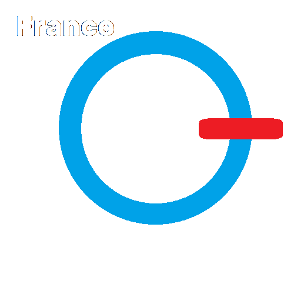

# France-OPG

  

-------------------------------------------------------------------------------------------

## Qui sommes nous ?

#### France - Organisme de Projet en Groupe®©
 -  Un groupe de Bénévol
 -  Qui réaliste des projets gratuit
 -  Alors vennez avec nous ! 

## Nos site internet :
 -  France-OPG : https://france-opg.tk
 -  ResPinGuy : https://respinguy.tk
 -  Chineur-Agglo-Boulonais : https://chineur-agglo-boulonnais.tk
 
-------------------------------------------------------------------------------------------
<!--
**France-OPG/France-OPG** is a ✨ _special_ ✨ repository because its `README.md` (this file) appears on your GitHub profile.

Here are some ideas to get you started:

- 🔭 I’m currently working on ...
- 🌱 I’m currently learning ...
- 👯 I’m looking to collaborate on ...
- 🤔 I’m looking for help with ...
- 💬 Ask me about ...
- 📫 How to reach me: ...
- 😄 Pronouns: ...
- ⚡ Fun fact: ...
-->
